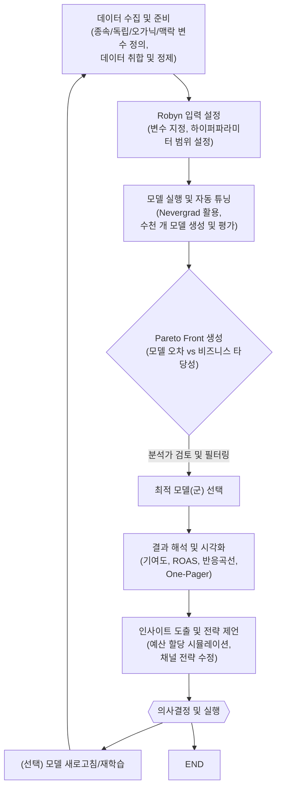

### 3. Robyn 프로세스 개요

Robyn을 활용한 마케팅 믹스 모델링 프로젝트는 일반적으로 다음과 같은 단계를 거쳐 진행됩니다. 각 단계는 반복적일 수 있으며, 분석 결과에 따라 이전 단계로 돌아가 조정을 거치기도 합니다.

1.  **데이터 수집 및 준비 (Data Collection and Preparation):**
    * **필수 데이터 정의:** 모델링에 필요한 데이터를 정의합니다. 이는 종속 변수(예: 주간 매출액), 독립 변수(각 마케팅 채널별 주간 지출액, 노출수 등), 오가닉 변수(예: 웹사이트 직접 방문자 수), 외부 요인 변수(공휴일, 프로모션 기간, 경쟁사 활동, 경제 지표 등)를 포함합니다.
    * **데이터 취합:** 정의된 변수들에 대한 과거 데이터를 수집합니다. 데이터는 보통 주간 단위로 집계됩니다.
    * **데이터 정제 및 전처리:** 결측치 처리, 이상치 탐지 및 조정, 데이터 형식 변환 등 모델링에 적합한 형태로 데이터를 가공합니다. Robyn은 Prophet과 같은 도구를 사용하여 휴일 효과 등을 자동으로 처리하는 기능도 제공합니다.

2.  **모델 실행 및 하이퍼파라미터 튜닝 (Model Execution & Hyperparameter Tuning):**
    * **입력 파일 설정:** Robyn에 필요한 입력값(데이터 파일 경로, 변수 정의, 하이퍼파라미터 범위 등)을 스크립트에 설정합니다.
    * **모델 학습:** Robyn은 설정된 하이퍼파라미터의 다양한 조합(수천 개에서 수만 개)을 탐색하며 다수의 모델을 자동으로 생성하고 평가합니다. 이 과정에서 `Nevergrad` 라이브러리가 사용되어 효율적인 최적화를 수행합니다.
    * 주요 하이퍼파라미터에는 각 채널의 Adstock 형태(Geometric, Weibull)와 그 파라미터(theta, shape, scale), 채널 변수의 계수 범위 등이 포함됩니다.

3.  **모델 선택 (Model Selection - Pareto Front):**
    * **Pareto Front 분석:** Robyn은 수많은 모델 결과를 바탕으로 'Pareto Front'를 제시합니다. Pareto Front는 모델의 오차(예: NRMSE - Normalized Root Mean Square Error 또는 DECOMP.RSSD - Decomposition Root Sum of Squared Distance)와 비즈니스적 타당성(예: 예산 제약 내에서의 채널별 지출 비중) 사이의 최적 균형점을 이루는 모델들의 집합입니다.
    * **모델 후보군 필터링:** 분석가는 Pareto Front 상의 모델들 중에서 비즈니스 이해도, 마케팅 상식, 결과의 안정성 등을 종합적으로 고려하여 최종 모델 또는 몇 개의 후보 모델을 선택합니다. 예를 들어 특정 채널의 ROAS가 비현실적으로 높거나 낮게 나온 모델은 제외할 수 있습니다.

4.  **결과 해석 및 인사이트 도출 (Result Interpretation & Insight Derivation):**
    * **핵심 지표 확인:** 선택된 모델의 주요 결과(채널별 기여도, ROAS, 반응 곡선, 이월 효과 등)를 확인합니다. Robyn은 'One-pager' 형태로 주요 결과를 요약해서 보여줍니다.
    * **반응 곡선 분석:** 각 채널의 지출액에 따른 반응 곡선을 통해 한계효용체감 및 포화 지점을 파악합니다. 이는 예산 최적화의 중요한 근거가 됩니다.
    * **기여도 분해:** 총매출이 각 마케팅 채널, 프로모션, 외부 요인 등에 의해 얼마나 설명되는지 분해하여 보여줍니다.
    * **인사이트 도출 및 전략 제언:** 분석 결과를 바탕으로 마케팅 예산 재분배, 채널 전략 수정 등 구체적인 실행안을 도출하고 제언합니다. Robyn의 예산 할당(Budget Allocator) 기능을 사용하여 다양한 시나리오를 시뮬레이션해 볼 수 있습니다.

이러한 과정을 시각적으로 표현하면 다음과 같습니다:

위 다이어그램은 Robyn을 사용한 MMM 프로세스의 일반적인 흐름을 보여줍니다. 실제 분석에서는 필요에 따라 특정 단계를 반복하거나 순서를 일부 조정할 수 있습니다.

---
